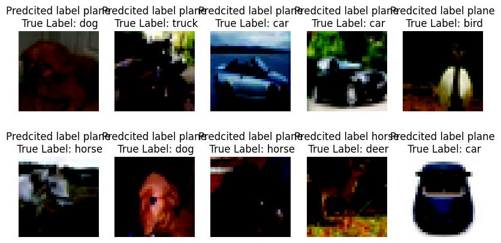
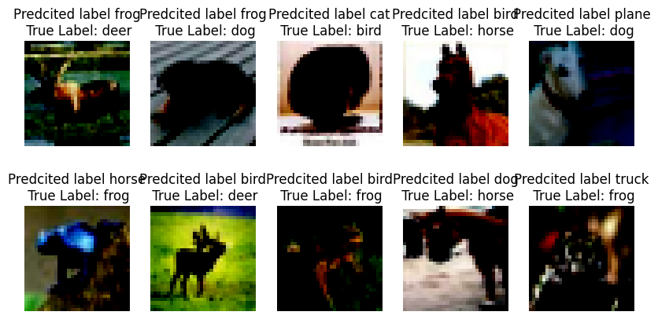

# Session 8 Assignment

## Objective
The goal of this assignment is to implement and evaluate the performance of model with different normalization techniques on the CIFAR10 dataset. 

The network has a specific architecture (C1 C2 c3 P1 C4 C5 C6 c7 P2 C8 C9 C10 GAP c11) with the total parameter count kept under 50,000. 
Where,"C" is nxn layer, "c" is 1x1 layer, "P" is max pooling and "GAP" is global avaerag pooling.

Three versions of the network are created, each applying a different normalization techniques: 

    Group Normalization (GN)
    Layer Normalization (LN)
    Batch Normalization (BN)

Each model is trained for 20 epochs, and the goal is to achieve an accuracy of above 70% for each model.

## Dataset
The CIFAR10 dataset consists of 60,000 32x32 color training images and 10,000 test images, labeled into 10 classes.
The 10 classes represent airplanes, cars, birds, cats, deer, dogs, frogs, horses, ships, and trucks. 
The dataset is divided into 50,000 training images and 10,000 validation images.

## Results

### BATCHNORM:

    Parameters: 44,160
    Training Accuracy: 77.26
    Test Accuracy: 75.50
    notebook file : s8_batch_norm.ipynb
misclassified_images: 

### GROUPNORM:
    Parameters: 44,160
    Training Accuracy: 74.41
    Test Accuracy: 75.24
    notebook file : GroupNorm.ipynb
misclassified_images: 

    
    
### LAYERNORM:
    Parameters: 51,674
    Training Accuracy: 58.40
    Test Accuracy: 61.36
    notebook file : s8_layer_norm.ipynb
misclassified_images:

